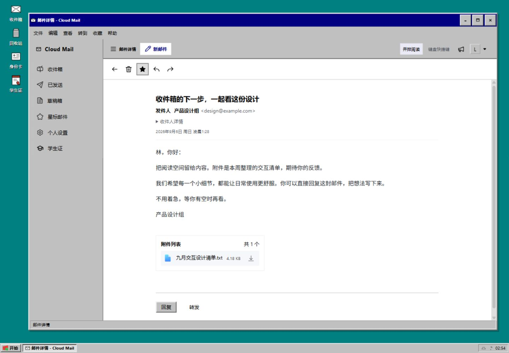
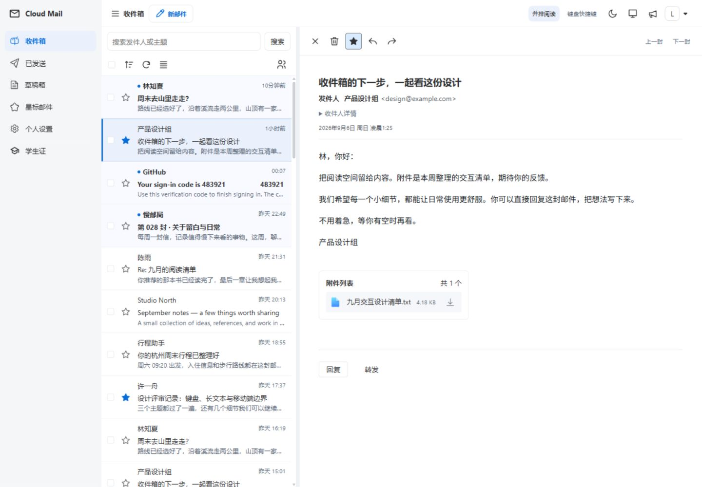
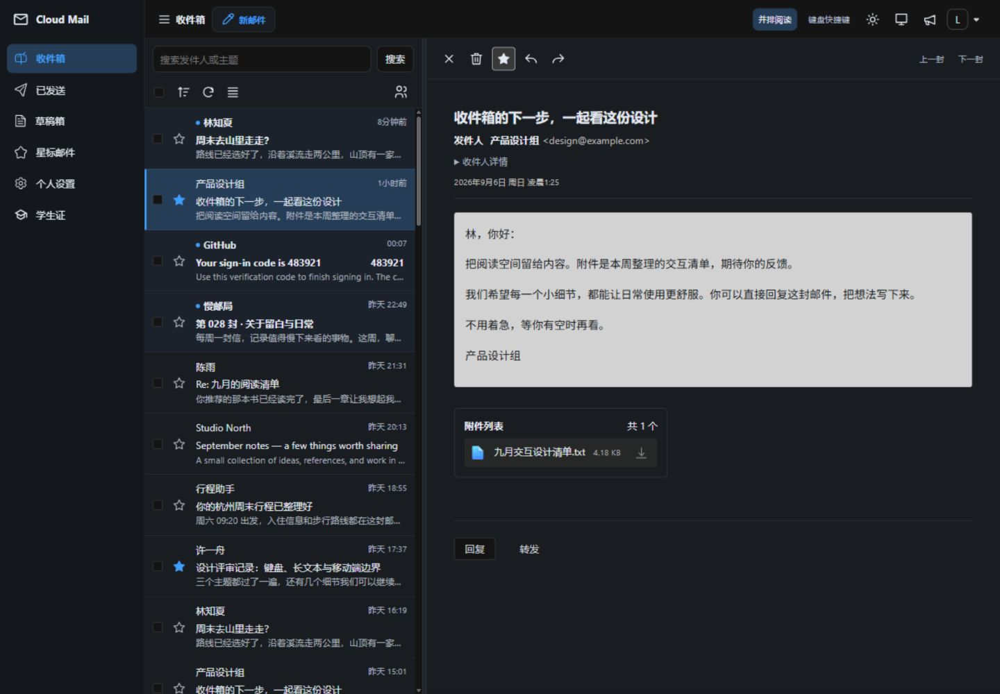
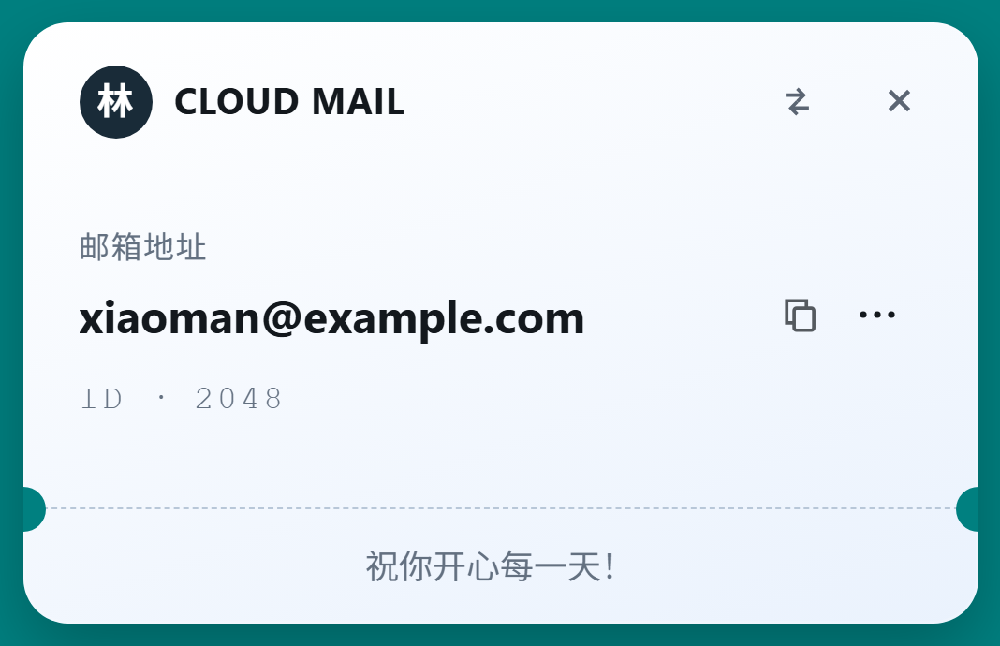

<p align="center">
  
</p>

<h1 align="center">Open CloudMail</h1>

<p align="center">A self-hosted email service powered by Cloudflare Workers, with a retro Windows 95 desktop and a modern mail workspace.</p>

<p align="center">
  <a href="README.md">简体中文</a> | English
</p>

<p align="center">
  <a href="LICENSE"></a>
  <a href="https://github.com/puremixai/open-cloudmail/issues"></a>
  <a href="https://github.com/puremixai/open-cloudmail/stargazers"></a>
</p>

## Project Origins

**Open CloudMail is a derivative of [maillab/cloud-mail](https://github.com/maillab/cloud-mail) (Cloud Mail).** Building on the upstream project's email sending and receiving, user management, and Cloudflare deployment capabilities, this project continues to improve the interface, community sign-in options, email privacy, and delivery reliability. We thank the original author and upstream contributors.

- Project repository: [puremixai/open-cloudmail](https://github.com/puremixai/open-cloudmail)
- Issue tracker: [Issues](https://github.com/puremixai/open-cloudmail/issues)
- Upstream deployment reference: [Cloud Mail documentation](https://doc.skymail.ink). For this fork, refer to the current code and the configuration and feature descriptions below.

The upstream demo site, community, and sponsorship channels are maintained by the upstream project and are not deployment or maintenance channels for this project. This repository retains the upstream MIT license and original copyright notice.

## Features and Improvements

### Key Improvements in This Fork

- **Three themes**: A retro Windows 95 desktop by default, with modern light and dark themes available. Includes a Start menu, taskbar, desktop windows, and responsive layouts.
- **Identity card and student ID pages**: Draggable, flippable identity cards with email copying, full-address display, remembered positions, and mobile layouts.
- **Mail workspace**: Side-by-side message list and message reading on wide screens, with an adjustable list width; supports continuous reading, restoring the current message from the address bar, compact and comfortable density settings, and keyboard shortcuts.
- **Search and compose experience**: Search the current mailbox by sender name, sender address, and subject; paste multiple recipients, validate addresses, and save and restore local drafts isolated by user and mailbox.
- **Community sign-in**: Supports Linux DO, GitHub, Google, and the newly added XAI Connect OIDC sign-in. New Linux DO and XAI users can currently bind a mailbox without a registration code.
- **Email privacy**: HTML email sanitization, external images loaded on demand, attachment access validation, and session-data cleanup when signing out or switching accounts.
- **Sending and receiving reliability**: Send-request deduplication, quota reservation, inbound-message deduplication and recovery, and attachment-cleanup retries. Sends with uncertain delivery status are retained for administrator review and are not automatically resent. Includes database upgrade scripts and regression tests.

### Core Email Capabilities

- Custom domains, multiple mailbox accounts, inbox, starred messages, sent messages, and contact management.
- Receive email through Cloudflare Email Routing and send through Resend or a configured Cloudflare `send_email` binding, with support for internal delivery, attachments, and inline images.
- Store attachments in R2 or S3-compatible object storage, falling back to KV when neither is configured; supports email forwarding and Telegram notifications.
- User and email administration, RBAC roles and permissions, registration codes, domains, and resource-usage limits.
- Open API, verification-code recognition with Workers AI, ECharts statistics, Turnstile verification, and site personalization.

Available features depend on administrator settings, role permissions, and connected services. Local drafts do not sync across devices. Search currently covers senders and subjects, not the full text of message bodies.

## Interface Preview

The screenshots below show this fork running locally with synthetic mailbox and message data.

| Windows 95 mail workspace | Modern light theme |
| --- | --- |
|  |  |
| **Modern dark theme** | **Identity card** |
|  |  |

For more screenshots and interaction details, see the [mail workspace guide](docs/product-design-2026-09-06/README.md) and [identity card guide](docs/idcard-ui-2026-09-06/README.md).

## Technology Stack

| Layer | Technologies |
| --- | --- |
| Frontend | Vue 3, Vite, Element Plus, Pinia, Vue Router, TinyMCE |
| Backend | Cloudflare Workers, Hono, Drizzle ORM |
| Data and files | Cloudflare D1, KV, R2 / S3-compatible object storage |
| Email and optional services | Cloudflare Email Routing, Resend, Workers AI, Turnstile |
| Testing and deployment | Vitest, Wrangler, GitHub Actions |

Production builds output the frontend to `mail-worker/dist` by default. The same Worker serves the site, `/api` endpoints, and attachment access.

## Local Development

The current CI environment uses **Node.js 24 and pnpm 11**; you can use the same versions locally. Run the following commands from the repository root. They are written for PowerShell.

```powershell
git clone https://github.com/puremixai/open-cloudmail.git
cd open-cloudmail
pnpm --dir mail-worker install --frozen-lockfile
pnpm --dir mail-vue install --frozen-lockfile
```

### Frontend-Only Preview

```powershell
pnpm --dir mail-vue dev
```

Open the [Windows 95 design preview](http://localhost:3001/design-preview.html?theme=win95#/inbox?message=999). You can also change `theme` to `light` or `dark`. This entry point uses a local mock API, so the Worker does not need to be running. Sending and deleting only modify the preview's in-memory data, which resets when the page is refreshed. This entry point is excluded from production builds.

### Full-Stack Development

1. Review `mail-worker/wrangler-dev.toml` and configure `domain`, `admin`, `jwt_secret`, and resource bindings for your development environment. Do not use the existing values in that file directly in production. When connecting your own Cloudflare resources, replace identifiers for D1, KV, and other resources.
2. Build the frontend first to generate the static asset directory required by the Worker configuration, then start the local Worker:

   ```powershell
   pnpm --dir mail-vue build
   pnpm --dir mail-worker dev
   ```

3. After the Worker starts, initialize the local database from another terminal. Replace the placeholder with the value from your development configuration:

   ```powershell
   Invoke-RestMethod 'http://127.0.0.1:8787/api/init/<jwt_secret>'
   ```

   A `success` response means initialization is complete. The initialization URL contains a secret; do not share the full URL.

4. Run `pnpm --dir mail-vue dev` and open the [local frontend](http://localhost:3001). By default, `.env.dev` sends requests to `http://127.0.0.1:8787/api`. To override it, use `mail-vue/.env.dev.local`.

Local full-stack development uses Wrangler's local resources. Actual email receiving and sending, object storage, and OAuth require separate configuration of the corresponding services.

### Tests and Builds

```powershell
pnpm --dir mail-worker test:unit
pnpm --dir mail-vue test:unit
pnpm --dir mail-vue build
```

## Deploying to Cloudflare

You need a Cloudflare account, a domain for email, a D1 database, and a KV namespace. Configure attachment storage, email sending, verification-code recognition, and bot protection as needed.

### GitHub Actions

The repository includes a [deployment workflow](.github/workflows/deploy-cloudflare.yml). After forking the repository, configure the following under **Settings → Secrets and variables → Actions** in your GitHub repository. Store sensitive values as Secrets.

| Setting | Required | Description |
| --- | --- | --- |
| `CLOUDFLARE_API_TOKEN` | Yes | API token used to deploy the Worker and access the required Cloudflare resources |
| `CLOUDFLARE_ACCOUNT_ID` | Yes | Cloudflare account ID |
| `DOMAIN` | Yes | JSON array of email domains, for example `["example.com"]` |
| `ADMIN` | Yes | Administrator email address, for example `admin@example.com`; its domain must be included in `DOMAIN` |
| `JWT_SECRET` | Yes | A random secret you generate. The current workflow does not accept `?`, `%`, `#`, `/`, or backslashes; a random hexadecimal string is recommended |
| `NAME` | No | Worker name; defaults to `cloud-mail` |
| `CUSTOM_DOMAIN` | No | Web access domain, for example `mail.example.com`, without the protocol; it may differ from the email domain |
| `D1_DATABASE_ID` | No | Reuse an existing D1 database. If omitted, the workflow finds or creates one using `NAME` |
| `KV_NAMESPACE_ID` | No | Reuse an existing KV namespace. If omitted, the workflow finds or creates one using `NAME` |
| `R2_BUCKET_NAME` | No | Name of an existing R2 bucket. If omitted, the workflow removes the R2 binding |
| `PROJECT_LINK` | No | Reserved switch for displaying the project link. The backend parses it as a Boolean switch; it is not a custom link URL |
| `AI_MODEL` | No | Workers AI model; see the workflow for the default |
| `ANALYSIS_CACHE` | No | Statistics cache switch; defaults to `false` |
| `CF_EMAIL` | No | Set to `true` to add the Cloudflare `send_email` binding; confirm its recipient restrictions before use |

Run the deployment workflow manually from **Actions**. Subsequent pushes to `main` that change frontend or backend code, or the workflow itself, also trigger a deployment; changes limited to README files do not. The workflow runs unit tests, existing-database migrations, build and deployment, and database initialization in sequence.

After deployment, complete the following configuration:

1. Enable Email Routing for the email domain in Cloudflare, complete the DNS configuration, and route the required addresses or Catch-all to this Worker.
2. Register an account on the site using the exact email address specified by `ADMIN`, and set a password. The code identifies the administrator by this email address; initialization does not create a default administrator password.
3. In system settings, configure Resend credentials and a verified sending domain. Configure attachment storage, Turnstile, notifications, and OAuth as needed.

### Manual Deployment and Upgrades

Manual deployment uses `mail-worker/wrangler.toml`. First replace the D1 and KV resource identifiers, set `domain`, `admin`, and `jwt_secret`, and configure a custom domain and optional bindings as needed. Keep the binding names used by the code: `db`, `kv`, and `assets`, plus `r2`, `ai`, and `email` when enabled.

After signing in to Wrangler and completing the configuration, run the following from the `mail-worker` directory:

```powershell
node scripts/migrate-mail-operations.mjs --remote --config wrangler.toml
pnpm run deploy
```

**Existing databases must be migrated before the new Worker is deployed.** The script skips the pre-deployment migration for an empty database. For both new installations and upgrades, visit `https://<site-domain>/api/init/<jwt_secret>` after deployment to complete initialization or subsequent migrations, and confirm that it returns `success`. GitHub Actions already includes these steps.

Back up the database before upgrading. Keep the hourly Cron trigger in the configuration; it is used for recovery of email operations, cleanup, and quota maintenance. Never commit real secrets to the repository.

## Third-Party Sign-In

Configure and enable Linux DO, GitHub, Google, or XAI Connect separately in system settings. The current configuration is stored in the database. Do not put OAuth Client Secrets in frontend `VITE_*` environment variables.

XAI Connect uses the `https://connect.xai.run` OIDC service adapted for this project. It requires a Client ID, Client Secret, and an exact HTTPS callback URL:

```text
https://<web-domain-of-your-email-site>/api/oauth/xai/callback
```

The callback must have the same origin as the actual sign-in site. The XAI Client Secret is stored encrypted on the backend; after changing `jwt_secret`, you must enter the secret again. See the [XAI OIDC design notes](docs/superpowers/specs/2026-08-29-xai-oidc-login-design.md) for implementation conventions. The current code defines the registration-code exemption behavior for Linux DO and XAI.

## Directory Structure

```text
open-cloudmail/
├── mail-vue/                 # Vue frontend
│   ├── src/                  # Pages, components, themes, state, and requests
│   ├── test/                 # Frontend regression tests
│   ├── design-preview.html   # Mock-data preview for development
│   └── .env.release          # Production build configuration
├── mail-worker/              # Cloudflare Worker backend
│   ├── src/                  # API, authentication, email processing, business logic, and migrations
│   ├── scripts/              # Pre-deployment database migrations
│   ├── test/                 # Backend regression tests
│   └── wrangler*.toml        # Local, manual, and Actions deployment configuration
├── .github/workflows/        # Test, build, and deployment workflows
├── docs/                     # Design, implementation, and acceptance records for this fork
├── doc/                      # Image assets retained from upstream
└── LICENSE
```

## License and Acknowledgments

This project is released under the [MIT License](LICENSE). The original copyright notice, `Copyright (c) 2025 aslost`, is retained in `LICENSE`. Thanks to the original author and contributors of [Cloud Mail](https://github.com/maillab/cloud-mail) for the foundation on which this project is built.
